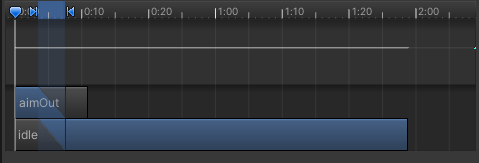

# 3DShooting

## Development Day 1: 2023.11.9

1. Unity 在场景中如何操作镜头：右键按住可以操控镜头，同时用WASD来移动，Q垂直下移，E垂直上移。
2. 获取组件的两种方式：
   1. 直接在Unity当中拖拽赋值：坏处是在打包时有可能丢失。
   2. 在代码中赋值：使用 GetComponent<>() 函数对组件进行获取。
3. transform.forward/right：forward是蓝色轴的方向，right是红色轴的方向。
4. transform.normalized：规范化，返回与原向量相比方向不变长度为1的向量。
5. Input.GetAxis在将轴映射到鼠标时该值会有所不同，不会再在[-1,1]的范围内。此时，该值为当前鼠标增量乘以轴灵敏度。正值表示鼠标向右/下移动，负值表示向上/左移动。

## Development Day 2: 2023.11.10

1. Cursor.lockState：**确定硬件指针是否锁定到视图的中心，受限于窗口或者根本不受限制**。锁定时，光标位于视图中心且无法移动，光标在此状态下不可见。 值为：CursorLockMode.Locked时，光标锁定在游戏窗口的中心.

   ```
   Cursor.lockState = CursorLockMode.Locked
   ```

2. Tooltip：设置的变量名称会在鼠标悬停时展示提示信息。

3. SerializeField：强制序列化，让private属性的值可以在Inspector当中显示。

4. Physics.CheckSphere()：如果有任何碰撞体与设定的球体有叠加就会返回true，用于判断球体是否右碰撞。

5. Physics.Raycast：向场景中的所有碰撞体投射射线，时刻碰撞。该射线起点为 /origin/，朝向 /direction/，长度为 /maxDistance/。

   ```c#
   Physics.Raycast(transform.position, Vector3.down, out slopeHit, playerHeight * 0.5f + 0.4f)
   
   //可以通过slopeHit.normal得到其法线方向。RaycastHit.normal：射线打中的表面的法线。
   ```

   其中： out 关键字可以将射线内容保存到指定的RaycastHit结构体当中。

## Development Day 3: 2023.11.11

​	个人习惯上还是将音频控制器但拎出来。不然打包在角色的代码里面的话，角色代码就会非常的庞杂，而且不好找，复用效果也不是很好。

1. 射击一般选用射线检测的方法，发出射线检测物体，判断是否打到了。即使用Physics.Raycast。
2. audioSource.isPlaying：可以用于判断当前音效是否正在播放。
3. 在整个场景中一般只有一个Audio Listener，加载在Camera上，如果设置多个的话Unity会不知道播放哪个监听器发出的声音。

## Development Day 4: 2023.11.12

1. 粒子效果：一般**火焰爆炸**，**水流**等等都用到粒子效果。需要创建诸如**火、烟或液体之类的动态对象**时，由于很难用网格 (3D) 或精灵 (2D) 描绘这种对象，因此粒子系统非常有用。网格和精灵更适合于描绘诸如房屋或汽车之类的实体对象。

2. 使用`ParticleEffect.Play()`;可以播放粒子特效。

3. **点光源**：“A Point Light is located at a point in space and sends light out in all directions equally. The direction of light hitting a surface is the line from the point of contact back to the center of the light object. The intensity diminishes with distance from the light, reaching zero at a specified range. Light intensity is inversely proportional to the square of the distance from the source. This is known as ‘inverse square law’ and is similar to how light behaves in the real world.”（摘自Unity手册）一般用于模拟场景中火花或者爆炸照亮周围环境。

4. `Quaternion.FromToRotation(fromDirection，toDirection)`：创建一个从 `fromDirection` 旋转到 `toDirection` 的旋转。

   Quaternion（摘自Unity手册）： 

   ​	四元数用于表示旋转。

   ​	它们结构紧凑，不受万向锁影响，可以轻松插值。 Unity 内部使用四元数来表示所有旋转。

   ​	它们基于复数，不容易理解。 您几乎不会有机会访问或修改单个四元数分量（x、y、z、w）； 大多数情况下，您只需要获取现有旋转（例如，来自 Transform），然后使用它们构造新的旋转 （例如，在两个旋转之间平滑插值）。 您绝大多数时间使用的四元数函数为：`Quaternion.LookRotation`、`Quaternion.Angle`、`Quaternion.Euler`、`Quaternion.Slerp`、`Quaternion.FromToRotation` 和 `Quaternion.identity`。（其他函数仅用于一些十分奇特的用例。）

   ​	您可以使用 `Quaternion.operator` 对旋转进行旋转，或对向量进行旋转。

   ​	注意，Unity 使用的是标准化的四元数。

5. `transform.position`和`transform.localPosition`：`localPosition`是相对于父物体变换的位置，`position`是世界空间中的变换位置。

6. `Vector3.Lerp`：线性插值，能起到一个平滑移动的效果。

7. `Anim.Play()`：可以直接播放指定动画。


## Development Day 5: 2023.11.13

1. `anim.CrossFadeInFixedTime("Fire", 0, 0)`可以实现使用以秒为单位的时间创建从当前状态到任何其他状态的淡入淡出效果。指定状态名称时，应该包含父层的名称。例如，如果`Base Layer`中有一个`Run`状态，则该名称为`BaseLayer.Run`。
2. `GetCurrentAnimatorStateInfo (int layerIndex);`返回当前层的动画状态，其中包含有关当前状态的信息。包括访问状态的速度、长度、名称和其他变量。
3. `mainCamera = Camera.main;`可以获取主相机，之后可以访问主相机的参数并进行修改；
4. 动画的过渡来说，整个播放流程是走的蓝色部分，因此在设置的时候可以通过调整蓝色部分的状态来调整动画变换的速度、节奏。


## Development Day 6: 2023.11.13

​	做个小总结，总的来说这次这个3D射击的小项目没有什么难度。原理和2D基本类似，只是会更多的将二维坐标映射到三维坐标当中，用到的物理引擎也多了很多。最突出的特征就是`Vector2`基本都改用`Vector3`了。3D能显示的效果比2D要多一些，粒子效果是比较突出的一个特征。当然2D也可以引入粒子效果，只是3D的粒子效果视觉感更好一些。

​	另一方面，这次跟着这个教程，我很多地方没有选择跟着老师的来写，因为这个教程里老师的代码习惯有些小毛病。例如冗余变量太多了，我自己的代码里一个变量可以解决的事情他用了3个。其次是代码耦合度太高了。如果要另外做一个角色会非常麻烦，所以我在自己的代码里将一些可以复用的东西全部分离了出来。最典型的例如：音频控制器和动画控制器。当然动画控制器封装出来其实没什么必要，因为每个物体的动画都要再次绑定一下脚本。

​	但是由于一个角色身上可能有多个脚本，多个脚本里都要实现动画功能，这样要获取好几次动画组件，我就一横心干脆把动画封装出来，做成一个单例，角色身上其他的脚本只要调用就好了。诶这么一看动画控制器的抽取好像还挺正确。

​	总之，这次的小项目已经逐渐开始加入了自己的思路优化代码和游戏视觉效果了，很有成就感。

